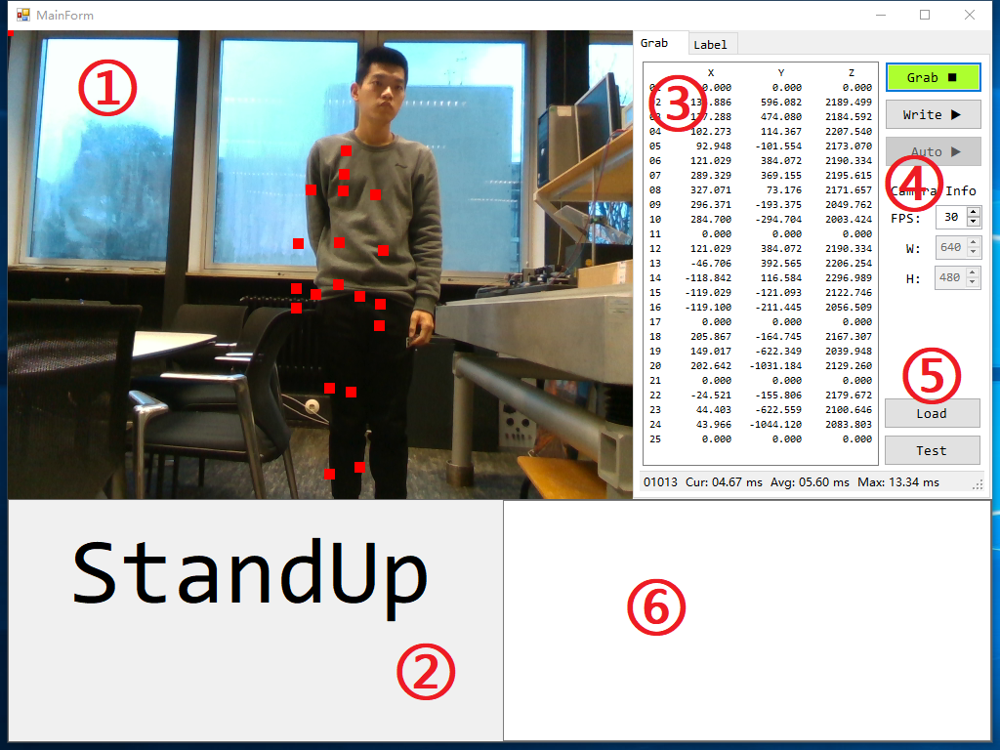
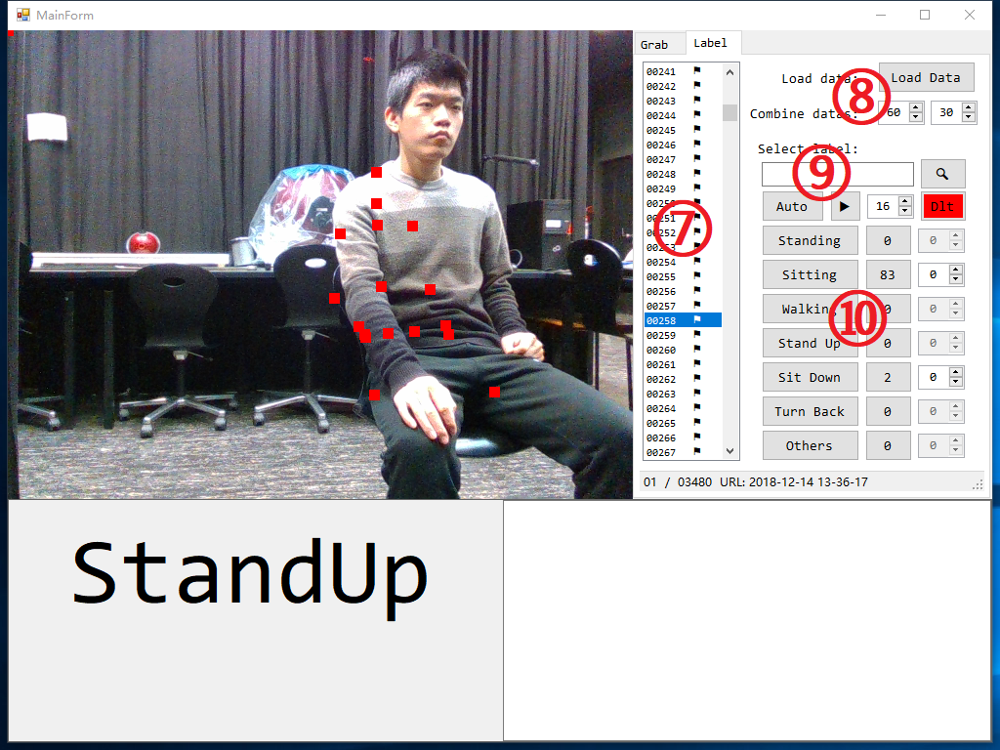

# Gesture Recognition

1.  [Real Sense](#1-Real-Sense)
    1.  [Download](#1-1-Download)
    2.  [Viewer](#1-2-Viewer)
    3.  [SDK](#1-3-SDK)
    4.  [Source Code](#1-4-Source-Code)
    5.  [More](#1-5-More)
2.  [NUITRACK](#2-NUITRACK)
    1.  [Download](#2-1-Download)
    2.  [Install](#2-2-Install)
    3.  [Examples](#2-3-Examples)
3.  [Demo](#3-Demo)
    1.  [Interface](#3-1-Interface)
    2.  [Output Folder Tree](#3-2-Output-Folder-Tree)
    3.  [Running](#3-3-Running)
        1.  [Capture](#3-3-1-Capture)
        2.  [Write data](#3-3-2-Write-data)
        3.  [Labeling](#3-3-3-Labeling)
        4.  [Display Sample](#3-3-4-Display-Sample)
        5.  [Test Sample](#3-3-5-Test-Sample)
        6.  [Auto Running](#3-3-6-Auto-Running)
4.  [Deep Learning](#4-Deep-Learning)
    1.  [Network Architecture](#4-1-Network-Architecture)
    2.  [Data Distribution](#4-2-Data-Distribution)
    3.  [Training Parameters](#4-3-Training-Parameters)
5.  [Issues](#5-Issues)
    1.  [Fix Camera Position](#5-1-Fix-Camera-Position)
    2.  [More Data](#5-2-More-Data)
    3.  [Network Optimization](#5-3-Network-Optimization)
    4.  [Interface Display Delay](#5-4-Interface-Display-Delay)


---


## 1 Real Sense

>   All instructions are based on `Real Sense 2.17.1` using `Depth Camera D435`. 
>

### 1-1 Download

-   [Intel® RealSense™ SDK 2.0 (build 2.17.1)](https://github.com/IntelRealSense/librealsense/releases/tag/v2.17.1)

### 1-2 Viewer

-   [Intel.RealSense.Viewer.exe](https://github.com/IntelRealSense/librealsense/releases/download/v2.17.1/Intel.RealSense.Viewer.exe)
    -   Executable depth camera control program
    -   Configure depth camera and color camera parameters

### 1-3 SDK

-   [Intel.RealSense.SDK.exe](https://github.com/IntelRealSense/librealsense/releases/download/v2.17.1/Intel.RealSense.SDK.exe)
    -   Installer with `Intel RealSense Viewer and Quality Tool`, `C/C++ Developer Package`, `Python 2.7/3.6 Developer Package`, `.NET Developer Package` and so on.
    -   You can find some demos in the root directory of the installation.

### 1-4 Source Code

-   [Source Code](https://github.com/IntelRealSense/librealsense/archive/v2.17.1.zip): Contains a folder named `librealsense-2.17.1`
-   Need to use `CMake ` for source code compilation
    -   Create a new folder `build` under folder `librealsense-2.17.1`
    -   Folder `librealsense-2.17.1` is the source code path
    -   Folder `librealsense-2.17.1\build` is the build path
    -   Visual Studio Solution: `librealsense2.sln` (C++)
        -   in the root directory `librealsense-2.17.1`
    -   Visual Studio Solution: `LANGUAGES.sln` (C#)
        -   in the directory `librealsense-2.17.1\build\wrappers\csharp`

### 1-5 More

-   [https://realsense.intel.com/intel-realsense-downloads](https://realsense.intel.com/intel-realsense-downloads)
-   [Best Known Methods for Tuning Intel RealSense Depth Cameras D415 and D435](https://www.intel.com/content/dam/support/us/en/documents/emerging-technologies/intel-realsense-technology/BKMs_Tuning_RealSense_D4xx_Cam.pdf)


## 2 NUITRACK

>   All instructions are based on `NUITRACK 1.3.8`. 

### 2-1 Download

-   Website: SDK & Samples
    -   [https://nuitrack.com](https://nuitrack.com)
    -   Unity, Unreal Engine, C++, C#
-   Online documentation
    -   [http://download.3divi.com/Nuitrack/doc](http://download.3divi.com/Nuitrack/doc)

### 2-2 Install

-   [Installation Instructions ](http://download.3divi.com/Nuitrack/doc/Installation_page.html)

    -   Download and run [nuitrack-windows-x86.exe](http://download.3divi.com/Nuitrack/platforms/nuitrack-windows-x86.exe) (for Windows 32-bit) or [nuitrack-windows-x64.exe](http://download.3divi.com/Nuitrack/platforms/nuitrack-windows-x64.exe) (for Windows 64-bit). Follow the instructions of the NUITRACK setup assistant. 
    -   Re-login to let the system changes take effect. 

    >   Normally, only the two steps need to be performed if your computer has been installed `Visual Studio`.

### 2-3 Examples

-   [nuitrack_console_sample/src/main.cpp](http://download.3divi.com/Nuitrack/doc/nuitrack_console_sample_2src_2main_8cpp-example.html)
-   [nuitrack_csharp_sample/Program.cs](http://download.3divi.com/Nuitrack/doc/nuitrack_csharp_sample_2Program_8cs-example.html) :star:
-   [nuitrack_gl_sample/src/main.cpp](http://download.3divi.com/Nuitrack/doc/nuitrack_gl_sample_2src_2main_8cpp-example.html)
-   [nuitrack_ni_gl_sample/src/main.cpp](http://download.3divi.com/Nuitrack/doc/nuitrack_ni_gl_sample_2src_2main_8cpp-example.html)


## 3 Demo

>   All codes are based on `.NET Framework 4.6.1` using `Visual Studio`.

### 3-1 Interface

<div align = center>
    
</div>

-   ①: Display the color image and the skeleton data with red square dots.
-   ②: Display the judged gesture: `Standing`, `Sitting`, `Walking`, `StandUp`, `SitDown`, `TurnBack`.
-   ③: Display the skeleton data, 25 points (XYZ, 75 float data) per frame.
-   ④: The main control
    -   `Grab`: Start or stop the camera grab.
    -   `Write`: Enabled or disabled write skeleton data.
    -   `Auto`: Enabled or disabled recognize the gesture automatically.
    -   `FPS`: Frame per second, also timer grab interval equals `1000.0 / FPS`.
    -   `W`: The width of image, read only.
    -   `H`: The height of image, read only.
-   ⑤: Load and test `.pb` model
    -   `Load`: Load a `.pb` model.
    -   `Test`: Test a sample using the loaded model.
-   ⑥: Output window, not used yet.

<div align = center>
    
</div>

-   ⑦: Display the skeleton data index. The small flag indicates that the data under the index is valid. 
-   ⑧: Load and config data.
    -   `Load`: Select a `.txt` file, see [3-2 Output Folder Tree](#3-2-Output-Folder-Tree) for more instructions.
    -   Combine data: 
        -   `1st number` indicates that the data of each 60 frames is combined into one sample.
        -   `2nd number` indicates that overlaps the data of 30 frames between every two samples.
-   ⑨: Search and select data.
    -   `Search`: Search and display the images of the sample.
    -   `Auto`: Auto select the next batch images, `batchSize = CombineData(1st number)`.
    -   `▶`: Display the select data and images.
    -   `Delay`: The delay time of display image.
    -   `Dlt`: Delete useless images after labeling.
-   ⑩: Labeling, 3 buttons per label.
    -   `1st button`: Write label data. 
    -   `2nd button`: Open label folder.
    -   `3rd button`: Display label sample.

### 3-2 Output Folder Tree


### 3-3 Running

#### 3-3-1 Capture

-   Make sure the computer is connected to the depth camera. 
-   Click `Grab` button, the images will be displayed in real time.  

#### 3-3-2 Write data

-   Click `Write` button, the folder will be created under the `Output` folder with the format of current time `yyyy-MM-dd HH-mm-ss` as the folder name. For example, creating a folder named `2019-01-10 10-40-54`. 
-   Further, in the `2019-01-10 10-40-54` folder, two folder named `Images` and `Labels` are created and a txt file named `Data` is generated. 
    -   `Images`: The color image with the joint position of the body using square red dots. 
    -   `Labels`: Txt and md files for each label.
    -   `Data.txt`: The information of the skeleton data. Normally, only the word `Skeleton data (X, Y, Z) * 25 points. `. 
-   Click `Grab` button to capture image, at the same time, write images and data. Which one of the `Grab` button and the `Write` button is pressed first, there is no requirement for use.

#### 3-3-3 Labeling

-   After writing the data, stop `Grab` and `Write`, switch to interface 2, click the `Load Data` button, and select the `data.txt` file under the selected folder.
-   In the interface ⑦, all the skeleton data lists under the selected folder are displayed. The small flag indicates that the data under the index is valid. 
-   Next, you need to select enough continuous data manually, or use the `Auto` button to let the program  select the data automatically. 
-   While you select the data, Interface ① will display the images, determine the current gesture manually based on the image information, and click the corresponding `1st button` in interface ⑩. after that, a sample will be automatically saved.

#### 3-3-4 Display Sample

-   Same as `labeling`, click the `Load Data` button, and select the `data.txt` file under the selected folder.
-   Click the corresponding `2nd button` in interface ⑩, the program will automatically open the save path of the selected label's sample.
-   Click the corresponding `3rd button` in interface ⑩, the program will automatically display the images of the selected sample in interface ①.

#### 3-3-5 Test Sample

-   Click the `Load` button in interface ⑤ and select the `.pb` model file to be tested. 
-   The first call to the model requires 3000ms to run, and the next run is less than 10ms. I do not know why. So when I load the model, I will call the model once to ensure that it will not time out when it is running automatically.
-   Click the `Test` button in interface ⑤ and select a sample, then the result will be displayed in ②. 

#### 3-3-6 Auto Running

-   Click the `Auto` button in interface ④, the program will automatically load the preset model, the model path can be modified by the `m_PB_URL` variable.
-   Click `Grab` button. 
-   Start your performance. 


## 4 Deep Learning

>   All codes are based on `Python 3.6.7 64-bit (TendorFlow)` using `Visual Studio Code`.

### 4-1 Network Architecture

A DNN(Deep Neural Network) architecture. (Multilayer perceptron 多层感知器)

```python
def dnn_5(inputs, num_classes=6, is_training=True, dropout_keep_prob=0.8, reuse=tf.AUTO_REUSE, scope='dnn_5'):
    ''' A DNN architecture with 4 hidden layers. 

        input --> (hidden layer) x 4 --> output

        hidden_layer_notes = [4096, 1024, 256, 64]
        1 x 4500 --> 1 x 4096 --> 1 x 1024 --> 1 x 256 --> 1 x 64 --> 1 x num_output

        Args:
            inputs           : The input data sets whose shape likes [1 x 4500]. 
            num_classes      : The number of output classes. 
            is_training      : Is training, if yes, it will ignore dropout_keep_prob.  
            dropout_keep_prob: The value of dropout parameter. 
            reuse            : 
            scope            :

        Return:
            net: The output of the net which do not input tf.nn.softmax. 

        Raise:

    '''
    with tf.variable_scope(scope, 'dnn_5', [inputs], reuse=reuse):
        ### hidden_layer_notes
        hidden_layer_notes = [4096, 1024, 256, 64]

        ### 1: hidden layer 1
        # 1 x 4500 --> 1 x 4096
        with tf.variable_scope('hidden1'):
            net = slim.fully_connected(inputs, hidden_layer_notes[0], scope='fc')
            net = slim.dropout(net, dropout_keep_prob, is_training=is_training, scope='dropout')
            
        ### 2: hidden layer 2
        # 1 x 4096 --> 1 x 1024
        with tf.variable_scope('hidden2'):
            net = slim.fully_connected(net, hidden_layer_notes[1], scope='fc')
            net = slim.dropout(net, dropout_keep_prob, is_training=is_training, scope='dropout')

        ### 3: hidden layer 3
        # 1 x 1024 --> 1 x 256
        with tf.variable_scope('hidden3'):
            net = slim.fully_connected(net, hidden_layer_notes[2], scope='fc')
            net = slim.dropout(net, dropout_keep_prob, is_training=is_training, scope='dropout')

        ### 4: hidden layer 4
        # 1 x 256 --> 1 x 64
        with tf.variable_scope('hidden4'):
            net = slim.fully_connected(net, hidden_layer_notes[3], scope='fc')
            net = slim.dropout(net, dropout_keep_prob, is_training=is_training, scope='dropout')
            
        ### 5: output layer
        # 1 x 64 --> 1 x num_classes
        with tf.variable_scope('output'):
            net = slim.fully_connected(net, num_classes, activation_fn=None, scope='fc')

        ### return
        return net
```

### 4-2 Data Distribution

|       | Standing | Sitting | Walking | StandUp | SitDown | TurnBack | All  |
| :---: | :------: | :-----: | :-----: | :-----: | :-----: | :------: | :--: |
| train |   227    |   229   |   135   |   193   |   194   |   150    | 1128 |
|  vld  |    0     |    0    |    0    |    0    |    0    |    0     |  0   |
| test  |    51    |   70    |   30    |   43    |   57    |    30    | 281  |
|  All  |   278    |   299   |   165   |   236   |   251   |   180    | 1409 |

### 4-3 Training Parameters

```
# ----------------------------------------------------------------------- #
# ------------------------ Run net at 2018-12-19 ------------------------ #
# ----------------------------------------------------------------------- #
# ---------------- train_step: 15000
# ---------------- batch_size: 32
# ---------------- learning_rate: 0.0001
# ---------------- dropout_keep_prob: 1.0

# ---------------- Test accuracy: 93.5943 %
```


## 5 Issues

### 5-1 Fix Camera Position

>   In my current experiment, the height of the camera is about 75 cm, and the angle of the camera is horizontal forward. All data collected is based on this premise.
>
>   This causes the gesture recognition result to deteriorate when the camera height or the camera angle is changed. 
>
>   For example, when raising the height of the camera, `Standing` is easily judged as `Sitting`.

-   I think the initial work should be to determine where the camera is installed.
-   Fix camera position, like fixing the camera to the corner of the ceiling of the room, which can make sure the field of view to cover the entire room.

### 5-2 More Data

>   Now, I only have 1409 samples. For deep learning, this number is too small.

-   I suggest finding more people and collecting more data after fixing the camera.

### 5-3 Network Optimization

>   I combine 60 frames of images with 25 points (75 float numbers) per frame, so 4500 float numbers are combined into a vector sample. 

-   The composition of the sample needs to be optimized. 

>   The network architecture is based on `Multilayer Perceptron`. 

-   It is the simplest network, so there is still a lot of optimization space.

### 5-4 Interface Display Delay

>   In the automatic running state, the gesture name displayed on interface ② has obvious delay.

-   Demo program bug, I will fix it as soon as possible.


