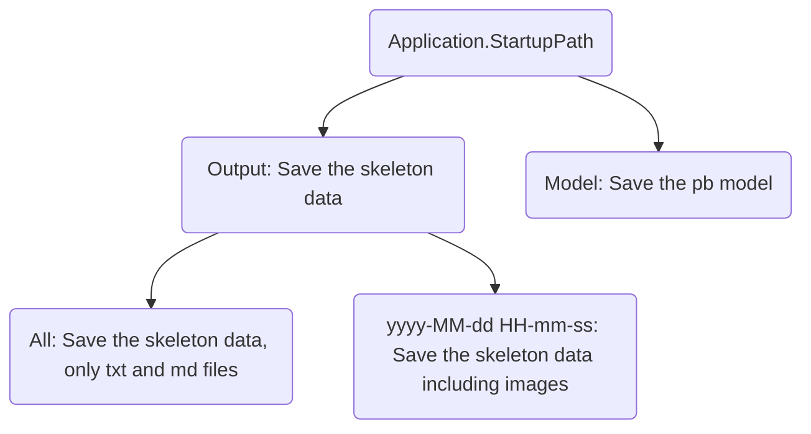

# Gesture Recognition

1.  [Real Sense](#1-Real-Sense)
    1.  [Download](#1-1-Download)
    2.  [Viewer](#1-2-Viewer)
    3.  [SDK](#1-3-SDK)
    4.  [Source Code](#1-4-Source-Code)
    5.  [More](#1-5-More)
2.  [NUITRACK](#2-NUITRACK)
    1.  [Download](#2-1-Download)
    2.  [Install](#2-2-Install)
    3.  [Examples](#2-3-Examples)
3.  [Demo](#3-Demo)
    1.  [Interface](#3-1-Interface)
    2.  

---

## 1 Real Sense

>   All instructions are based on `Real Sense 2.17.1` using `Depth Camera D435`. 
>

### 1-1 Download

-   [Intel® RealSense™ SDK 2.0 (build 2.17.1)](https://github.com/IntelRealSense/librealsense/releases/tag/v2.17.1)

### 1-2 Viewer

-   [Intel.RealSense.Viewer.exe](https://github.com/IntelRealSense/librealsense/releases/download/v2.17.1/Intel.RealSense.Viewer.exe)
    -   Executable depth camera control program
    -   Configure depth camera and color camera parameters

### 1-3 SDK

-   [Intel.RealSense.SDK.exe](https://github.com/IntelRealSense/librealsense/releases/download/v2.17.1/Intel.RealSense.SDK.exe)
    -   Installer with `Intel RealSense Viewer and Quality Tool`, `C/C++ Developer Package`, `Python 2.7/3.6 Developer Package`, `.NET Developer Package` and so on.
    -   You can find some demos in the root directory of the installation.

### 1-4 Source Code

-   [Source Code](https://github.com/IntelRealSense/librealsense/archive/v2.17.1.zip)
-   Contains a folder named `librealsense-2.17.1`
-   Need to use `CMake ` for source code compilation
    -   Create a new folder `build` under folder `librealsense-2.17.1`
    -   Folder `librealsense-2.17.1` is the source code path
    -   Folder `librealsense-2.17.1\build` is the build path
    -   Visual Studio Solution: `librealsense2.sln` (C++)
        -   in the root directory `librealsense-2.17.1`
    -   Visual Studio Solution: `LANGUAGES.sln` (C#)
        -   in the directory `librealsense-2.17.1\build\wrappers\csharp`

### 1-5 More

-   [https://realsense.intel.com/intel-realsense-downloads](https://realsense.intel.com/intel-realsense-downloads)
-   [Best Known Methods for Tuning Intel RealSense Depth Cameras D415 and D435](https://www.intel.com/content/dam/support/us/en/documents/emerging-technologies/intel-realsense-technology/BKMs_Tuning_RealSense_D4xx_Cam.pdf)

## 2 NUITRACK

>   All instructions are based on `NUITRACK 1.3.8`. 

### 2-1 Download

-   Website: SDK & Samples
    -   [https://nuitrack.com](https://nuitrack.com)
    -   Unity, Unreal Engine, C++, C#
-   Online documentation
    -   [http://download.3divi.com/Nuitrack/doc](http://download.3divi.com/Nuitrack/doc)

### 2-2 Install

-   [Installation Instructions ](http://download.3divi.com/Nuitrack/doc/Installation_page.html)

    -   Download and run [nuitrack-windows-x86.exe](http://download.3divi.com/Nuitrack/platforms/nuitrack-windows-x86.exe) (for Windows 32-bit) or [nuitrack-windows-x64.exe](http://download.3divi.com/Nuitrack/platforms/nuitrack-windows-x64.exe) (for Windows 64-bit). Follow the instructions of the NUITRACK setup assistant. 
    -   Re-login to let the system changes take effect. 

    >   Normally, only the two steps need to be performed if your computer has been installed `Visual Studio`.

### 2-3 Examples

-   [nuitrack_console_sample/src/main.cpp](http://download.3divi.com/Nuitrack/doc/nuitrack_console_sample_2src_2main_8cpp-example.html)
-   [nuitrack_csharp_sample/Program.cs](http://download.3divi.com/Nuitrack/doc/nuitrack_csharp_sample_2Program_8cs-example.html) :star:
-   [nuitrack_gl_sample/src/main.cpp](http://download.3divi.com/Nuitrack/doc/nuitrack_gl_sample_2src_2main_8cpp-example.html)
-   [nuitrack_ni_gl_sample/src/main.cpp](http://download.3divi.com/Nuitrack/doc/nuitrack_ni_gl_sample_2src_2main_8cpp-example.html)

## 3 Demo

>   All codes are based on `.NET Framework 4.6.1` using `Visual Studio`.

### 3-1 Interface

    

-   ①: Display the color image and the skeleton data with red square points.
-   ②: Display the judged gesture: `Standing`, `Sitting`, `Walking`, `StandUp`, `SitDown`, `TurnBack`.
-   ③: Display the skeleton data, 25 points (XYZ) per frame.
-   ④: The main control
    -   `Grab`: Start or Stop the camera grab.
    -   `Write`: Enabled or disabled write skeleton data.
    -   `Auto`: Enabled or disabled recognize the gesture automatically.
    -   `FPS`: Frame per second, also timer grab interval equals `1000.0 / FPS`.
    -   `W`: The width of image. 
    -   `H`: The height of image. 
-   ⑤: Load and test `.pb` model
    -   `Load`: Load a `.pb` model.
    -   `Test`: Test a sample using the loaded model.
-   ⑥: Output window, not used yet.

    

-   ①: Display the skeleton data index. The small flag indicates that the data under the index is valid. 
-   ②: Load and config data.
    -   `Load`: Select a `.txt` file, see `3-2` for more instructions.
    -   Combine data: 
        -   `1st number` indicates that the data of each 60 frames is combined into one sample.
        -   `2nd number` indicates that overlaps the data of 30 frames between every two samples.
-   ③: Search and select data.
    -   `Search`: Search and display the images of the sample
    -   `Auto`: Auto select the next batch images, `batchSize = CombineData`.
    -   `▶`: Display the select data and images.
    -   `Delay`: Display image delay time.
    -   `Dlt`: Delete useless images after labeling.
-   ④: Labeling, 3 buttons per label.
    -   `1st button`: Write label data. 
    -   `2nd button`: Open label folder.
    -   `3rd button`: Display label sample.

### 3-2 Data Format

#### 3-2-1 Output Folder Tree

## 4 Deep Learning

## 5 Issues

